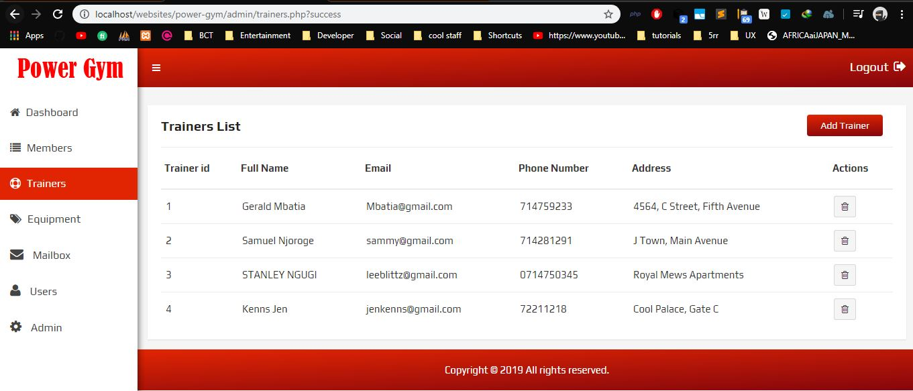

# power-gym
DESCRIPTION

This is a gym website with an admin panel to manage the gym.

#How to run

**Required**
Wamp/Xampp server
*************
1. clone the project into your htdocs directory.
2. import the *power_gym.sql* database in '$htdocs/power-gym/database/' directory
3. run *localhost/power-gym*
4. To log in to the portal:
    
    email: MJ@gmail.com
    password: 12121212 

#Screenshot
Visitors Landing Page

-------Admin Panel---------
Dashboard

Members

Trainers

Users

